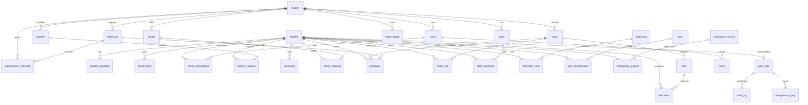

# Hostel Management System -- Minimal ER Diagram

## 32 Tables | 3NF | Table Names + Relationships Only

```mermaid
erDiagram
    hostel ||--o{ room : "contains"
    hostel ||--o{ mess : "runs"
    hostel ||--o{ laundry : "provides"
    hostel ||--o{ facility : "offers"
    hostel ||--o{ store : "has"
    hostel ||--o{ notice_board : "posts"
    hostel ||--o{ maintenance_schedule : "plans"
    hostel ||--o{ technician : "employs"

    student ||--o{ student_guardian : "has"
    student ||--o{ allocation : "assigned"
    student ||--o{ feepayment : "pays"
    student ||--o{ mess_subscription : "subscribes"
    student ||--o{ laundry_request : "requests"
    student ||--o{ accesslog : "logs"
    student ||--o{ facility_booking : "books"
    student ||--o{ complaint : "raises"
    student ||--o{ visitor_log : "visited_by"
    student ||--o{ store_purchase : "buys"
    student ||--o{ pharmacy_visit : "visits"
    student ||--o{ gym_membership : "enrolls"
    student ||--o{ emergency_request : "calls"
    student ||--o| auth_user : "authenticates"

    room ||--o{ bed : "contains"
    bed ||--o{ allocation : "reserved"
    room ||--o{ complaint : "about"
    room ||--o{ visitor_log : "at"

    technician ||--o{ complaint : "resolves"
    technician ||--o{ maintenance_schedule : "executes"

    mess ||--o{ mess_subscription : "has"
    mess ||--o{ menu : "serves"

    laundry ||--o{ laundry_request : "receives"
    facility ||--o{ facility_booking : "reserved"
    store ||--o{ store_purchase : "sells"
    pharmacy ||--o{ pharmacy_visit : "records"
    gym ||--o{ gym_membership : "enrolls"
    ambulance_service ||--o{ emergency_request : "dispatched"

    auth_user ||--o{ audit_log : "performed"
    auth_user ||--o{ idempotency_key : "owns"
```
