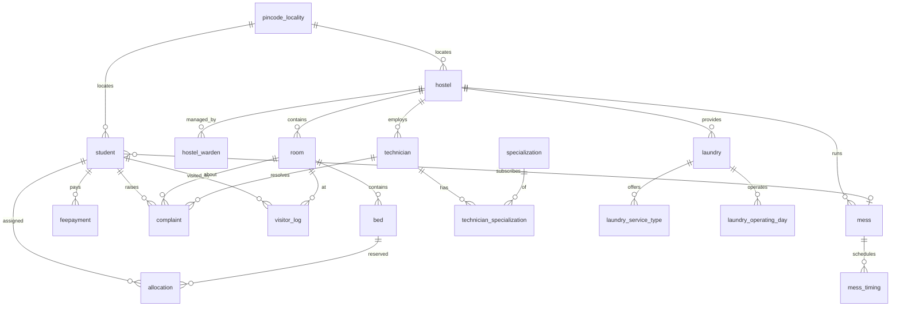

# Hostel Management System -- ER Diagram

## 18 Tables | 3NF+ | Table Names + Relationships

```mermaid
erDiagram
    pincode_locality ||--o{ hostel : "locates"
    pincode_locality ||--o{ student : "locates"

    hostel ||--o{ hostel_warden : "managed_by"
    hostel ||--o{ room : "contains"
    hostel ||--o{ mess : "runs"
    hostel ||--o{ laundry : "provides"
    hostel ||--o{ technician : "employs"

    student ||--o{ allocation : "assigned"
    student ||--o{ feepayment : "pays"
    student ||--o{ complaint : "raises"
    student ||--o{ visitor_log : "visited_by"
    student }o--o| mess : "subscribes"

    room ||--o{ bed : "contains"
    room ||--o{ complaint : "about"
    room ||--o{ visitor_log : "at"

    bed ||--o{ allocation : "reserved"

    technician ||--o{ complaint : "resolves"
    technician ||--o{ technician_specialization : "has"
    specialization ||--o{ technician_specialization : "of"

    mess ||--o{ mess_timing : "schedules"

    laundry ||--o{ laundry_service_type : "offers"
    laundry ||--o{ laundry_operating_day : "operates"
```
