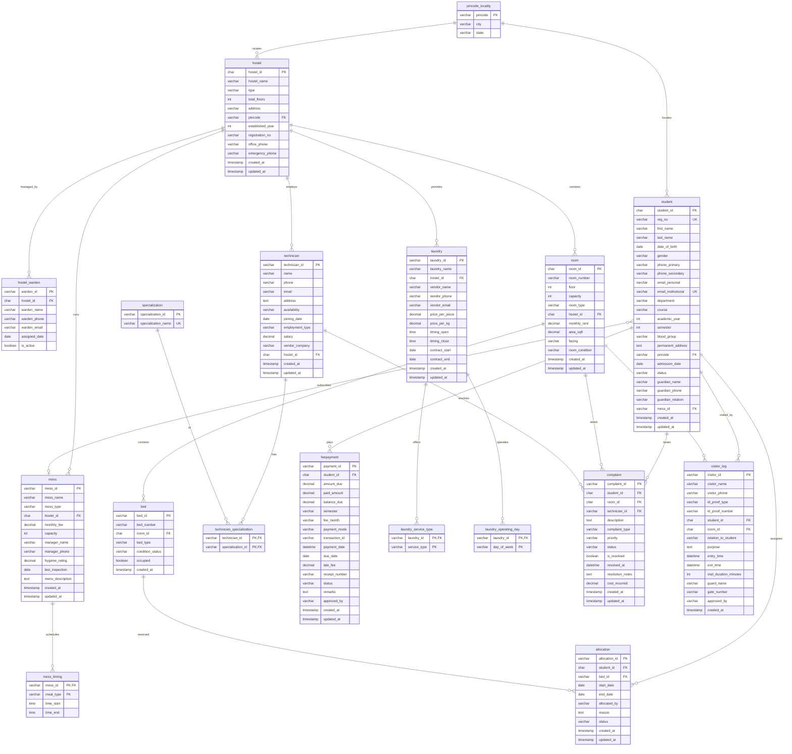

# Hostel Management System -- Detailed ER Diagram

## 18 Tables | 3NF+ | All Columns + Relationships

```mermaid
erDiagram
    pincode_locality {
        varchar pincode PK
        varchar city
        varchar state
    }

    hostel {
        char hostel_id PK
        varchar hostel_name
        varchar type
        int total_floors
        varchar address
        varchar pincode FK
        int established_year
        varchar registration_no
        varchar office_phone
        varchar emergency_phone
        timestamp created_at
        timestamp updated_at
    }

    hostel_warden {
        varchar warden_id PK
        char hostel_id FK
        varchar warden_name
        varchar warden_phone
        varchar warden_email
        date assigned_date
        boolean is_active
    }

    mess {
        varchar mess_id PK
        varchar mess_name
        varchar mess_type
        char hostel_id FK
        decimal monthly_fee
        int capacity
        varchar manager_name
        varchar manager_phone
        decimal hygiene_rating
        date last_inspection
        text menu_description
        timestamp created_at
        timestamp updated_at
    }

    mess_timing {
        varchar mess_id PK, FK
        varchar meal_type PK
        time time_start
        time time_end
    }

    student {
        char student_id PK
        varchar reg_no UK
        varchar first_name
        varchar last_name
        date date_of_birth
        varchar gender
        varchar phone_primary
        varchar phone_secondary
        varchar email_personal
        varchar email_institutional UK
        varchar department
        varchar course
        int academic_year
        int semester
        varchar blood_group
        text permanent_address
        varchar pincode FK
        date admission_date
        varchar status
        varchar guardian_name
        varchar guardian_phone
        varchar guardian_relation
        varchar mess_id FK
        timestamp created_at
        timestamp updated_at
    }

    room {
        char room_id PK
        varchar room_number
        int floor
        int capacity
        varchar room_type
        char hostel_id FK
        decimal monthly_rent
        decimal area_sqft
        varchar facing
        varchar room_condition
        timestamp created_at
        timestamp updated_at
    }

    bed {
        varchar bed_id PK
        varchar bed_number
        char room_id FK
        varchar bed_type
        varchar condition_status
        boolean occupied
        timestamp created_at
    }

    specialization {
        varchar specialization_id PK
        varchar specialization_name UK
    }

    technician {
        varchar technician_id PK
        varchar name
        varchar phone
        varchar email
        text address
        varchar availability
        date joining_date
        varchar employment_type
        decimal salary
        varchar vendor_company
        char hostel_id FK
        timestamp created_at
        timestamp updated_at
    }

    technician_specialization {
        varchar technician_id PK, FK
        varchar specialization_id PK, FK
    }

    allocation {
        varchar allocation_id PK
        char student_id FK
        varchar bed_id FK
        date start_date
        date end_date
        varchar allocated_by
        text reason
        varchar status
        timestamp created_at
        timestamp updated_at
    }

    feepayment {
        varchar payment_id PK
        char student_id FK
        decimal amount_due
        decimal paid_amount
        decimal balance_due
        varchar semester
        varchar fee_month
        varchar payment_mode
        varchar transaction_id
        datetime payment_date
        date due_date
        decimal late_fee
        varchar receipt_number
        varchar status
        text remarks
        varchar approved_by
        timestamp created_at
        timestamp updated_at
    }

    laundry {
        varchar laundry_id PK
        varchar laundry_name
        char hostel_id FK
        varchar vendor_name
        varchar vendor_phone
        varchar vendor_email
        decimal price_per_piece
        decimal price_per_kg
        time timing_open
        time timing_close
        date contract_start
        date contract_end
        timestamp created_at
        timestamp updated_at
    }

    laundry_service_type {
        varchar laundry_id PK, FK
        varchar service_type PK
    }

    laundry_operating_day {
        varchar laundry_id PK, FK
        varchar day_of_week PK
    }

    complaint {
        varchar complaint_id PK
        char student_id FK
        char room_id FK
        varchar technician_id FK
        text description
        varchar complaint_type
        varchar priority
        varchar status
        boolean is_resolved
        datetime resolved_at
        text resolution_notes
        decimal cost_incurred
        timestamp created_at
        timestamp updated_at
    }

    visitor_log {
        varchar visitor_id PK
        varchar visitor_name
        varchar visitor_phone
        varchar id_proof_type
        varchar id_proof_number
        char student_id FK
        char room_id FK
        varchar relation_to_student
        text purpose
        datetime entry_time
        datetime exit_time
        int visit_duration_minutes
        varchar guard_name
        varchar gate_number
        varchar approved_by
        timestamp created_at
    }

    pincode_locality ||--o{ hostel : "locates"
    pincode_locality ||--o{ student : "locates"

    hostel ||--o{ hostel_warden : "managed_by"
    hostel ||--o{ room : "contains"
    hostel ||--o{ mess : "runs"
    hostel ||--o{ laundry : "provides"
    hostel ||--o{ technician : "employs"

    student ||--o{ allocation : "assigned"
    student ||--o{ feepayment : "pays"
    student ||--o{ complaint : "raises"
    student ||--o{ visitor_log : "visited_by"
    student }o--o| mess : "subscribes"

    room ||--o{ bed : "contains"
    room ||--o{ complaint : "about"
    room ||--o{ visitor_log : "at"

    bed ||--o{ allocation : "reserved"

    technician ||--o{ complaint : "resolves"
    technician ||--o{ technician_specialization : "has"
    specialization ||--o{ technician_specialization : "of"

    mess ||--o{ mess_timing : "schedules"

    laundry ||--o{ laundry_service_type : "offers"
    laundry ||--o{ laundry_operating_day : "operates"
```
