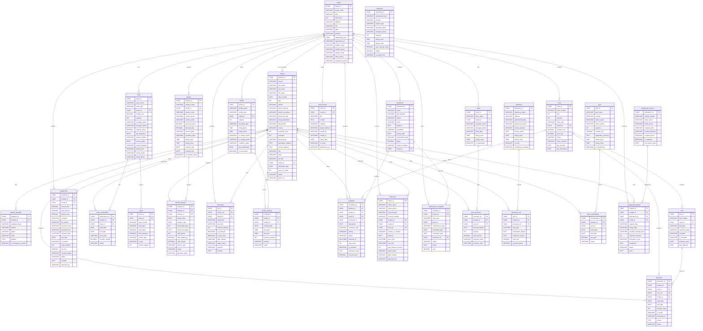

# Hostel Management System -- ER Diagram

## Schema: 29 Tables | MySQL 8.0+ | UUID Primary Keys

```mermaid
erDiagram
    hostel {
        CHAR hostel_id PK
        VARCHAR hostel_name
        VARCHAR type
        INT total_floors
        VARCHAR address
        VARCHAR city
        VARCHAR state
        VARCHAR pincode
        YEAR established_year
        VARCHAR registration_no
        VARCHAR warden_name
        VARCHAR warden_phone
        VARCHAR warden_email
        VARCHAR office_phone
        VARCHAR emergency_phone
    }
    student {
        CHAR student_id PK
        VARCHAR reg_no
        VARCHAR first_name
        VARCHAR last_name
        VARCHAR full_name
        DATE date_of_birth
        INT age
        VARCHAR gender
        VARCHAR phone_primary
        VARCHAR phone_secondary
        VARCHAR email_personal
        VARCHAR email_institutional
        VARCHAR department
        VARCHAR course
        INT academic_year
        INT semester
        VARCHAR blood_group
        TEXT permanent_address
        TEXT current_address
        VARCHAR city
        VARCHAR state
        VARCHAR pincode
        CHAR hostel_id FK
        DATE admission_date
        INT years_in_hostel
        VARCHAR status
        VARCHAR photo_url
    }
    student_guardian {
        CHAR guardian_id PK
        CHAR student_id FK
        VARCHAR guardian_name
        VARCHAR relation
        VARCHAR phone
        VARCHAR email
        TEXT address
        BOOLEAN is_emergency_contact
    }
    room {
        CHAR room_id PK
        VARCHAR room_number
        INT floor
        INT capacity
        VARCHAR room_type
        CHAR hostel_id FK
        DECIMAL monthly_rent
        DECIMAL area_sqft
        VARCHAR facing
        VARCHAR room_condition
        DATE last_cleaned
        DATE last_maintained
    }
    bed {
        CHAR bed_id PK
        VARCHAR bed_number
        CHAR room_id FK
        VARCHAR bed_type
        VARCHAR condition_status
        BOOLEAN occupied
        BOOLEAN is_available
        DATE purchase_date
        DATE last_replaced
    }
    technician {
        CHAR technician_id PK
        VARCHAR name
        VARCHAR specialization
        VARCHAR phone
        VARCHAR email
        TEXT address
        VARCHAR availability
        DATE joining_date
        VARCHAR employment_type
        DECIMAL salary
        VARCHAR vendor_company
        CHAR hostel_id FK
    }
    allocation {
        CHAR allocation_id PK
        CHAR student_id FK
        CHAR bed_id FK
        CHAR room_id FK
        CHAR hostel_id FK
        DATE start_date
        DATE end_date
        INT duration_days
        BOOLEAN is_active
        VARCHAR allocated_by
        TEXT reason
        VARCHAR status
    }
    feepayment {
        CHAR payment_id PK
        CHAR student_id FK
        CHAR hostel_id FK
        DECIMAL amount_due
        DECIMAL paid_amount
        DECIMAL balance_due
        VARCHAR semester
        VARCHAR fee_month
        VARCHAR payment_mode
        VARCHAR transaction_id
        DATETIME payment_date
        DATE due_date
        BOOLEAN is_overdue
        INT days_overdue
        DECIMAL late_fee
        VARCHAR receipt_number
        VARCHAR status
        TEXT remarks
        VARCHAR approved_by
    }
    mess {
        CHAR mess_id PK
        VARCHAR mess_name
        VARCHAR mess_type
        CHAR hostel_id FK
        DECIMAL monthly_fee
        INT capacity
        VARCHAR manager_name
        VARCHAR manager_phone
        DECIMAL hygiene_rating
        DATE last_inspection
        VARCHAR license_number
        DATE license_expiry
        VARCHAR timing_breakfast
        VARCHAR timing_lunch
        VARCHAR timing_snacks
        VARCHAR timing_dinner
    }
    mess_subscription {
        CHAR subscription_id PK
        CHAR student_id FK
        CHAR mess_id FK
        DATE start_date
        DATE end_date
        VARCHAR meal_plan
        DECIMAL monthly_charge
        VARCHAR status
    }
    menu {
        CHAR menu_id PK
        CHAR mess_id FK
        VARCHAR day_of_week
        VARCHAR meal_type
        VARCHAR item_name
        VARCHAR item_category
        VARCHAR cuisine_type
        BOOLEAN is_veg
        INT calories_approx
    }
    laundry {
        CHAR laundry_id PK
        VARCHAR laundry_name
        CHAR hostel_id FK
        VARCHAR vendor_name
        VARCHAR vendor_phone
        VARCHAR vendor_email
        DECIMAL price_per_piece
        DECIMAL price_per_kg
        VARCHAR service_types
        VARCHAR operating_days
        TIME timing_open
        TIME timing_close
        DATE contract_start
        DATE contract_end
        BOOLEAN is_contract_active
    }
    laundry_request {
        CHAR request_id PK
        CHAR student_id FK
        CHAR laundry_id FK
        DATE pickup_date
        DATE delivery_date
        INT turnaround_days
        TEXT items_description
        INT total_pieces
        DECIMAL total_weight_kg
        DECIMAL total_charge
        VARCHAR service_type
        VARCHAR status
        VARCHAR payment_status
    }
    accesslog {
        CHAR log_id PK
        CHAR student_id FK
        CHAR hostel_id FK
        DATETIME entry_time
        DATETIME exit_time
        INT duration_minutes
        BOOLEAN is_overnight
        BOOLEAN is_late_entry
        VARCHAR gate_number
        VARCHAR guard_name
        VARCHAR purpose
        TEXT remarks
    }
    facility {
        CHAR facility_id PK
        VARCHAR facility_name
        VARCHAR facility_type
        CHAR hostel_id FK
        INT capacity
        VARCHAR operating_days
        TIME timing_open
        TIME timing_close
        VARCHAR in_charge_name
        VARCHAR in_charge_phone
        VARCHAR condition_status
        DATE last_maintained
        BOOLEAN is_operational
    }
    facility_booking {
        CHAR booking_id PK
        CHAR facility_id FK
        CHAR student_id FK
        DATE booking_date
        TIME slot_start
        TIME slot_end
        INT duration_minutes
        VARCHAR purpose
        VARCHAR status
    }
    complaint {
        CHAR complaint_id PK
        CHAR student_id FK
        CHAR hostel_id FK
        CHAR room_id FK
        CHAR technician_id FK
        TEXT description
        VARCHAR complaint_type
        VARCHAR priority
        VARCHAR status
        DATETIME resolved_at
        INT days_open
        BOOLEAN is_resolved
        TEXT resolution_notes
        DECIMAL cost_incurred
    }
    visitor_log {
        CHAR visitor_id PK
        VARCHAR visitor_name
        VARCHAR visitor_phone
        VARCHAR id_proof_type
        VARCHAR id_proof_number
        CHAR student_id FK
        CHAR hostel_id FK
        CHAR room_id FK
        VARCHAR relation_to_student
        TEXT purpose
        DATETIME entry_time
        DATETIME exit_time
        INT visit_duration_minutes
        VARCHAR guard_name
        VARCHAR gate_number
        VARCHAR approved_by
    }
    notice_board {
        CHAR notice_id PK
        CHAR hostel_id FK
        VARCHAR title
        TEXT content
        VARCHAR category
        VARCHAR target_audience
        VARCHAR posted_by
        DATETIME posted_at
        DATE expiry_date
        BOOLEAN is_active
        VARCHAR attachment_url
    }
    maintenance_schedule {
        CHAR schedule_id PK
        CHAR hostel_id FK
        VARCHAR area_type
        CHAR area_id
        VARCHAR maintenance_type
        DATE scheduled_date
        DATE completed_date
        CHAR technician_id FK
        VARCHAR status
        TEXT notes
        DECIMAL cost
    }
    store {
        CHAR store_id PK
        VARCHAR store_name
        CHAR hostel_id FK
        VARCHAR manager_name
        VARCHAR manager_phone
        VARCHAR store_type
        TIME timing_open
        TIME timing_close
        BOOLEAN is_operational
    }
    store_purchase {
        CHAR purchase_id PK
        CHAR student_id FK
        CHAR store_id FK
        TEXT item_description
        INT quantity
        DECIMAL total_amount
        VARCHAR payment_mode
        DATETIME purchase_date
    }
    pharmacy {
        CHAR pharmacy_id PK
        VARCHAR pharmacy_name
        VARCHAR address
        VARCHAR pharmacist_name
        VARCHAR pharmacist_phone
        VARCHAR license_number
        DATE license_expiry
        TIME timing_open
        TIME timing_close
        BOOLEAN is_24hr
        BOOLEAN emergency_available
    }
    pharmacy_visit {
        CHAR visit_id PK
        CHAR student_id FK
        CHAR pharmacy_id FK
        DATETIME visit_date
        TEXT prescription_details
        TEXT medicines_issued
        DECIMAL total_cost
        VARCHAR payment_status
    }
    restaurant {
        CHAR restaurant_id PK
        VARCHAR restaurant_name
        VARCHAR location
        VARCHAR cuisine_type
        VARCHAR manager_name
        VARCHAR manager_phone
        INT capacity
        TIME timing_open
        TIME timing_close
        DECIMAL avg_cost_per_meal
        DECIMAL rating
        BOOLEAN is_operational
    }
    gym {
        CHAR gym_id PK
        VARCHAR gym_name
        VARCHAR location
        VARCHAR trainer_name
        VARCHAR trainer_phone
        INT capacity
        DECIMAL monthly_fee
        TEXT equipment_summary
        TIME timing_open
        TIME timing_close
        BOOLEAN is_operational
    }
    gym_membership {
        CHAR membership_id PK
        CHAR student_id FK
        CHAR gym_id FK
        DATE start_date
        DATE end_date
        DECIMAL fee_paid
        VARCHAR status
    }
    ambulance_service {
        CHAR ambulance_id PK
        VARCHAR vehicle_number
        VARCHAR driver_name
        VARCHAR driver_phone
        VARCHAR hospital_name
        VARCHAR hospital_address
        VARCHAR hospital_phone
        BOOLEAN is_available
        DATE last_service_date
    }
    emergency_request {
        CHAR request_id PK
        CHAR student_id FK
        CHAR ambulance_id FK
        CHAR hostel_id FK
        DATETIME request_time
        DATETIME pickup_time
        DATETIME hospital_reached_time
        INT response_minutes
        VARCHAR emergency_type
        TEXT description
        VARCHAR status
        TEXT notes
    }

    hostel ||--o{ student : "accommodates"
    hostel ||--o{ room : "contains"
    hostel ||--o{ mess : "runs"
    hostel ||--o{ laundry : "provides"
    hostel ||--o{ facility : "offers"
    hostel ||--o{ store : "has"
    hostel ||--o{ accesslog : "monitors"
    hostel ||--o{ visitor_log : "records"
    hostel ||--o{ notice_board : "posts"
    hostel ||--o{ maintenance_schedule : "plans"
    hostel ||--o{ feepayment : "collects"
    hostel ||--o{ complaint : "receives"
    hostel ||--o{ technician : "employs"
    hostel ||--o{ emergency_request : "responds"
    student ||--o{ student_guardian : "has"
    student ||--o{ allocation : "assigned"
    student ||--o{ feepayment : "pays"
    student ||--o{ mess_subscription : "subscribes"
    student ||--o{ laundry_request : "requests"
    student ||--o{ accesslog : "logs"
    student ||--o{ facility_booking : "books"
    student ||--o{ complaint : "raises"
    student ||--o{ visitor_log : "visited_by"
    student ||--o{ store_purchase : "buys"
    student ||--o{ pharmacy_visit : "visits"
    student ||--o{ gym_membership : "enrolls"
    student ||--o{ emergency_request : "calls"
    room ||--o{ bed : "contains"
    room ||--o{ allocation : "assigned"
    room ||--o{ complaint : "about"
    bed ||--o{ allocation : "reserved"
    technician ||--o{ complaint : "resolves"
    technician ||--o{ maintenance_schedule : "executes"
    mess ||--o{ mess_subscription : "has"
    mess ||--o{ menu : "serves"
    laundry ||--o{ laundry_request : "receives"
    facility ||--o{ facility_booking : "reserved"
    store ||--o{ store_purchase : "sells"
    pharmacy ||--o{ pharmacy_visit : "records"
    gym ||--o{ gym_membership : "enrolls"
    ambulance_service ||--o{ emergency_request : "dispatched"
```
