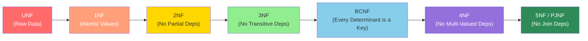
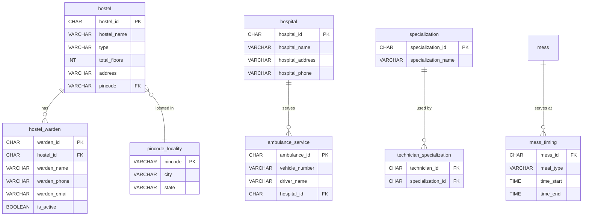

# DormFlow — Database Normalization Journey (1NF → 5NF)

> **System**: Hostel Management System (DormFlow)  
> **RDBMS**: MySQL 8.0+  
> **Original table count**: 29 core + 3 auth = 32  
> **Final table count (5NF)**: 42

---

## Table of Contents

1. [Overview](#overview)
2. [First Normal Form (1NF)](#1-first-normal-form-1nf)
3. [Second Normal Form (2NF)](#2-second-normal-form-2nf)
4. [Third Normal Form (3NF)](#3-third-normal-form-3nf)
5. [Boyce-Codd Normal Form (BCNF)](#4-boyce-codd-normal-form-bcnf)
6. [Fourth Normal Form (4NF)](#5-fourth-normal-form-4nf)
7. [Fifth Normal Form (5NF)](#6-fifth-normal-form-5nf--project-join-normal-form)
8. [Complete Change Log](#complete-change-log)
9. [Entity-Relationship Summary](#entity-relationship-summary)

---

## Overview

Database normalization is the process of organizing a relational database to reduce data redundancy and improve data integrity. Each normal form builds on the previous one, adding stricter constraints on what kinds of functional and multi-valued dependencies are permitted.



---

## 1. First Normal Form (1NF)

### Rule
> A table is in 1NF if:
> 1. All columns contain **atomic** (indivisible) values
> 2. There are **no repeating groups** or arrays
> 3. Each row is **uniquely identifiable** (has a primary key)

### What the Original (UNF → 1NF) Schema Looked Like

The original schema was designed with all 29 tables, each having a UUID primary key (`CHAR(36) DEFAULT UUID()`). The initial design was *mostly* in 1NF from the start, but with important issues:

### Violations Found & Fixed

#### 1.1 — `student.full_name` as a Derived Composite

| Before (UNF-ish) | After (1NF) |
|---|---|
| `full_name VARCHAR(200)` | `first_name VARCHAR(100)` + `last_name VARCHAR(100)` |

**Problem**: `full_name` like `'Arjun Mehta'` is a composite value derived from first and last names. While stored atomically as a string, it violates the *spirit* of 1NF because it's a concatenation of two independent facts. Querying by last name alone requires `LIKE '%Mehta'` which is inefficient and error-prone.

**Functional dependency introduced**:
```
{first_name, last_name} → full_name   (trivially derived)
```

**Fix**: Split into `first_name` and `last_name`. The `full_name` is reconstructed via `CONCAT()` in views.

---

#### 1.2 — All Tables Have Primary Keys ✅

Every table was designed with `CHAR(36) DEFAULT (UUID()) PRIMARY KEY`, satisfying the unique identification requirement of 1NF. Example:

```sql
student_id CHAR(36) NOT NULL DEFAULT (UUID()) PRIMARY KEY
```

---

#### 1.3 — Repeating Groups Check ✅

No tables contained array columns or nested structures. Columns like `medicines_issued TEXT` in `pharmacy_visit` store free-text descriptions (not structured arrays), which is acceptable at 1NF.

---

### Summary of 1NF State

| Metric | Value |
|--------|-------|
| Tables | 29 core + 3 auth = 32 |
| Violation type | Composite `full_name` |
| Tables modified | `student` (split name) |
| New tables added | 0 |

---

## 2. Second Normal Form (2NF)

### Rule
> A table is in 2NF if:
> 1. It is in 1NF, AND
> 2. Every non-key attribute is **fully functionally dependent** on the **entire** primary key (no partial dependencies)

### Analysis

2NF violations only occur with **composite primary keys**. If all primary keys are single-column, then partial dependencies are impossible — every non-key attribute is trivially fully dependent on the single-column PK.

**DormFlow's schema uses single-column UUID primary keys for every table** → **2NF is automatically satisfied.**

### Verification

```
hostel:          PK = {hostel_id}          — single column ✅
student:         PK = {student_id}         — single column ✅
allocation:      PK = {allocation_id}      — single column ✅
feepayment:      PK = {payment_id}         — single column ✅
... (all 32 tables follow this pattern)
```

Even tables like `bed` which have a `UNIQUE(room_id, bed_number)` constraint use `bed_id` as the PK, not the composite. The UNIQUE constraint is a candidate key but not the primary key, so 2NF is not violated.

### Summary of 2NF State

| Metric | Value |
|--------|-------|
| Tables | 32 (unchanged from 1NF) |
| Violations found | 0 |
| Reason | All PKs are single-column UUIDs |

---

## 3. Third Normal Form (3NF)

### Rule
> A table is in 3NF if:
> 1. It is in 2NF, AND  
> 2. No non-key attribute is **transitively dependent** on the primary key
>
> In other words: non-key columns must depend on "the key, the whole key, and nothing but the key."

### Violations Found & Fixed

**10 transitive dependencies** were identified and removed across 7 tables:

---

#### 3.1 — `student.hostel_id` (REMOVED)

**Transitive dependency chain**:
```
student_id → allocation → bed_id → room_id → hostel_id
```

A student's hostel is determined by their current bed allocation — not by the student entity itself. Storing `hostel_id` directly on `student` creates a transitive dependency.

**Fix**: Removed `hostel_id` from `student`. Hostel is derived via:
```
student → allocation (Active) → bed → room → hostel
```

---

#### 3.2 — `allocation.hostel_id` (REMOVED)

**Transitive dependency chain**:
```
allocation_id → bed_id → room_id → hostel_id
```

**Fix**: Removed. Hostel is derived via `bed → room → hostel` JOIN chain.

---

#### 3.3 — `allocation.room_id` (REMOVED)

**Transitive dependency chain**:
```
allocation_id → bed_id → room_id
```

**Fix**: Removed. Room is derived via `bed → room`.

---

#### 3.4 — `feepayment.hostel_id` (REMOVED)

**Transitive dependency chain**:
```
payment_id → student_id → (allocation) → hostel_id
```

**Fix**: Removed. Hostel derived via student's active allocation.

---

#### 3.5 — `complaint.hostel_id` (REMOVED)

**Transitive dependency chains** (two paths):
```
complaint_id → student_id → (allocation) → hostel_id
complaint_id → room_id → hostel_id
```

**Fix**: Removed. Hostel derived via either path.

---

#### 3.6 — `visitor_log.hostel_id` (REMOVED)

**Transitive dependency chain**:
```
visitor_id → student_id → (allocation) → hostel_id
```

**Fix**: Removed. Hostel derived via student's active allocation.

---

#### 3.7 — `accesslog.hostel_id` (REMOVED)

**Transitive dependency chain**:
```
log_id → student_id → (allocation) → hostel_id
```

**Fix**: Removed.

---

#### 3.8 — `emergency_request.hostel_id` (REMOVED)

**Transitive dependency chain**:
```
request_id → student_id → (allocation) → hostel_id
```

**Fix**: Removed.

---

#### 3.9 — `bed.is_available` (REMOVED)

**Transitive dependency**:
```
bed_id → occupied → is_available   (is_available = NOT occupied)
```

`is_available` is the exact logical inverse of `occupied`. Storing both creates a transitive dependency and risks data inconsistency.

**Fix**: Removed `is_available`. Derived as `NOT occupied` in queries.

---

#### 3.10 — `student.full_name` (already split in 1NF, but the transitive dependency is worth noting)

```
student_id → {first_name, last_name} → full_name
```

This was already resolved in the 1NF step by splitting the name. The view layer reconstructs `full_name` via `CONCAT(first_name, ' ', last_name)`.

---

### Views Added for Backward Compatibility

To ensure application queries remain unchanged, **9 views** were created in `02_views.sql` that reconstruct the removed columns via JOINs:

| View | Purpose |
|------|---------|
| `v_active_allocation` | Helper — student's current bed/room/hostel |
| `v_student_full_profile` | Reconstructs full_name, hostel_name, room |
| `v_room_occupancy` | Room occupancy with available_beds |
| `v_fee_summary` | Fee payments with hostel context |
| `v_complaint_dashboard` | Complaints with hostel, room, technician |
| `v_hostel_stats` | Hostel summary statistics |
| `v_daily_access` | Access logs with hostel context |
| `v_visitor_log` | Visitor logs with hostel context |
| `v_emergency_request` | Emergency requests with hostel context |

### Summary of 3NF State

| Metric | Value |
|--------|-------|
| Tables | 32 (unchanged count) |
| Columns removed | 10 across 7 tables |
| Views added | 9 (for backward compatibility) |
| Key technique | Derive redundant data via JOINs through existing FKs |

---

## 4. Boyce-Codd Normal Form (BCNF)

### Rule
> A table is in BCNF if:
> 1. It is in 3NF, AND
> 2. For every non-trivial functional dependency `X → Y`, **X must be a superkey**
>
> The difference from 3NF: 3NF allows `X → Y` where Y is part of a candidate key and X is not a superkey. BCNF does not allow this exception.

### Violations Found & Fixed

---

#### 4.1 — `hostel`: Warden Entity Embedded

**Functional dependency violating BCNF**:
```
{warden_name} → {warden_phone, warden_email}
```

`warden_name` is a determinant (warden's phone and email depend on who the warden is, not which hostel they're in), but `warden_name` is not a superkey of `hostel`.

**Real-world consequence**: If a warden is reassigned to manage two hostels, their contact info is duplicated. If their phone changes, both rows must be updated.

**Fix**: Extract `hostel_warden` table:

```sql
-- NEW TABLE
CREATE TABLE hostel_warden (
    warden_id    CHAR(36) PRIMARY KEY,
    hostel_id    CHAR(36) NOT NULL → hostel,
    warden_name  VARCHAR(100) NOT NULL,
    warden_phone VARCHAR(15),
    warden_email VARCHAR(100),
    assigned_date DATE,
    is_active    BOOLEAN DEFAULT TRUE
);
```

**Columns removed from `hostel`**: `warden_name`, `warden_phone`, `warden_email`

---

#### 4.2 — `hostel` & `student`: Pincode → City/State

**Functional dependency violating BCNF**:
```
pincode → {city, state}
```

In the Indian postal system, a pincode uniquely determines a city and state. This means `pincode` is a determinant, but it is not a superkey of either `hostel` or `student`.

**Real-world consequence**: If 10 students share pincode `600001`, the city `Chennai` and state `Tamil Nadu` are stored 10 times. A postal redistricting would require updating all rows.

**Fix**: Extract `pincode_locality` lookup table:

```sql
-- NEW TABLE
CREATE TABLE pincode_locality (
    pincode VARCHAR(10) PRIMARY KEY,
    city    VARCHAR(100) NOT NULL,
    state   VARCHAR(100) NOT NULL
);
```

**Columns removed**:
- `hostel`: `city`, `state` removed; `pincode` becomes FK → `pincode_locality`
- `student`: `city`, `state` removed; `pincode` becomes FK → `pincode_locality`

---

#### 4.3 — `ambulance_service`: Hospital Entity Embedded

**Functional dependency violating BCNF**:
```
hospital_name → {hospital_address, hospital_phone}
```

A hospital's address and phone depend on the hospital itself, not on which ambulance is currently associated with it. `hospital_name` is a determinant but not a superkey.

**Real-world consequence**: Two ambulances serving the same hospital would duplicate the hospital's address and phone. If the hospital moves or changes its number, multiple ambulance records must be updated.

**Fix**: Extract `hospital` table:

```sql
-- NEW TABLE
CREATE TABLE hospital (
    hospital_id      CHAR(36) PRIMARY KEY,
    hospital_name    VARCHAR(100) NOT NULL,
    hospital_address VARCHAR(255),
    hospital_phone   VARCHAR(15)
);
```

**Columns removed from `ambulance_service`**: `hospital_name`, `hospital_address`, `hospital_phone`
**Column added to `ambulance_service`**: `hospital_id CHAR(36)` FK → `hospital`

---

### Summary of BCNF State

| Metric | Value |
|--------|-------|
| New tables | +3 (`pincode_locality`, `hostel_warden`, `hospital`) |
| Running total | 35 tables |
| Columns removed | 8 across 3 tables |
| Key insight | Non-key determinants (pincode, warden, hospital) extracted to own tables |

---

## 5. Fourth Normal Form (4NF)

### Rule
> A table is in 4NF if:
> 1. It is in BCNF, AND
> 2. It has **no non-trivial multi-valued dependencies** (MVDs)
>
> A multi-valued dependency `X ↠ Y` means: for a given value of X, there is a well-defined set of values of Y, and this set is independent of other attributes.

### Violations Found & Fixed

---

#### 5.1 — `technician.specialization`: Multi-Valued as CSV

**Multi-valued dependency**:
```
technician_id ↠ specialization
```

**Current data**: `'Plumbing & Electrical'`, `'AC & Appliances'` — these encode multiple specializations as a single string.

**Why this violates 4NF**: A technician can have multiple specializations (e.g., Plumbing, Electrical), and these are independent of other attributes like salary or employment type. Storing them as a single string means:
- Cannot index individual specializations
- Cannot enforce referential integrity
- Cannot query "find all plumbers" without `LIKE '%Plumbing%'`

**Fix**: Extract `specialization` lookup + `technician_specialization` junction table:

```sql
-- NEW TABLES
CREATE TABLE specialization (
    specialization_id   CHAR(36) PRIMARY KEY,
    specialization_name VARCHAR(100) NOT NULL UNIQUE
);

CREATE TABLE technician_specialization (
    technician_id     CHAR(36) NOT NULL → technician,
    specialization_id CHAR(36) NOT NULL → specialization,
    PRIMARY KEY (technician_id, specialization_id)
);
```

**Column removed from `technician`**: `specialization`

---

#### 5.2 — `laundry.service_types`: Multi-Valued as CSV

**Multi-valued dependency**:
```
laundry_id ↠ service_type
```

**Current data**: `'Wash, Iron, Dry Clean'` — a comma-separated list of service types.

**Fix**: Extract `laundry_service_type` junction table:

```sql
-- NEW TABLE
CREATE TABLE laundry_service_type (
    laundry_id   CHAR(36) NOT NULL → laundry,
    service_type VARCHAR(50) NOT NULL,
    PRIMARY KEY (laundry_id, service_type)
);
```

**Column removed from `laundry`**: `service_types`

---

#### 5.3 — `laundry.operating_days` & `facility.operating_days`: Multi-Valued as Range String

**Multi-valued dependencies**:
```
laundry_id  ↠ operating_day
facility_id ↠ operating_day
```

**Current data**: `'Mon-Sat'`, `'Mon-Sun'`, `'Mon-Fri'` — these encode a set of days as a range string. While compact, this violates 4NF because:
- Cannot query "which laundries are open on Wednesday?" without parsing
- Cannot enforce that only valid day names are used

**Fix**: Extract junction tables:

```sql
-- NEW TABLES
CREATE TABLE laundry_operating_day (
    laundry_id    CHAR(36) NOT NULL → laundry,
    day_of_week   VARCHAR(10) NOT NULL,
    PRIMARY KEY (laundry_id, day_of_week)
);

CREATE TABLE facility_operating_day (
    facility_id   CHAR(36) NOT NULL → facility,
    day_of_week   VARCHAR(10) NOT NULL,
    PRIMARY KEY (facility_id, day_of_week)
);
```

**Columns removed**: `laundry.operating_days`, `facility.operating_days`

---

#### 5.4 — `mess`: Four Timing Columns are a Repeating Group

**Multi-valued dependency**:
```
mess_id ↠ {meal_type, timing}
```

**Current columns**: `timing_breakfast`, `timing_lunch`, `timing_snacks`, `timing_dinner` represent the same fact type (timing for a meal) repeated across four column names. This is a repeating group in disguise — what if a mess adds a "Late Night" meal? A new column must be added, violating the open-closed principle.

**Fix**: Extract `mess_timing` table:

```sql
-- NEW TABLE
CREATE TABLE mess_timing (
    mess_id    CHAR(36) NOT NULL → mess,
    meal_type  VARCHAR(20) NOT NULL,
    time_start TIME NOT NULL,
    time_end   TIME NOT NULL,
    PRIMARY KEY (mess_id, meal_type)
);
```

**Columns removed from `mess`**: `timing_breakfast`, `timing_lunch`, `timing_snacks`, `timing_dinner`

---

### Summary of 4NF State

| Metric | Value |
|--------|-------|
| New tables | +6 (`specialization`, `technician_specialization`, `laundry_service_type`, `laundry_operating_day`, `facility_operating_day`, `mess_timing`) |
| Running total | 41 tables |
| Columns removed | 8 across 4 tables |
| Key insight | CSV/multi-value fields decomposed into proper junction tables |

---

## 6. Fifth Normal Form (5NF) / Project-Join Normal Form

### Rule
> A table is in 5NF if:
> 1. It is in 4NF, AND
> 2. Every **join dependency** is implied by the candidate keys
>
> A join dependency means the table can be decomposed into three or more smaller tables and losslessly reconstructed via joins. If such a decomposition exists and isn't implied by candidate keys, the table violates 5NF.

### Violations Found & Fixed

---

#### 6.1 — `maintenance_schedule`: Polymorphic Foreign Key (area_type + area_id)

**Join dependency**:
```
maintenance_schedule = π₁(schedule_id, hostel_id, maintenance_type, ...) 
                     ⋈ π₂(schedule_id, area_type, area_id)
```

**Current design**: `area_type` = `'Room'` means `area_id` references `room.room_id`, while `area_type` = `'Common Area'` means `area_id` is NULL. This polymorphic FK pattern creates an ambiguous join dependency — the meaning of `area_id` depends on `area_type`, which cannot be enforced by a foreign key constraint.

**Problems**:
- No referential integrity (DB can't enforce that `area_id` exists in the right table)
- Query semantics depend on a string discriminator — fragile
- Adding new area types (e.g., 'Corridor', 'Roof') requires code changes, not schema changes

**Fix**: Replace polymorphic FK with explicit nullable FK + boolean:

```sql
-- MODIFIED: maintenance_schedule
-- REMOVED:  area_type VARCHAR(50)
-- REMOVED:  area_id CHAR(36)
-- ADDED:    room_id CHAR(36) FK → room (NULL for common areas)
-- ADDED:    is_common_area BOOLEAN DEFAULT FALSE
```

Now the join dependency is fully implied by the candidate key, and referential integrity is enforced.

---

#### 6.2 — `store_purchase`: Multi-Item Purchases in Single Row

**Join dependency**:
```
store_purchase = π₁(purchase_id, student_id, store_id, payment_mode, purchase_date)
               ⋈ π₂(purchase_id, item_name, quantity, unit_price)
```

**Current data**: `item_description = 'Biscuits, Water bottle'`, `quantity = 3`, `total_amount = 85.00`. This encodes a multi-item purchase as a single row with a text description of items.

**Problems**:
- Cannot determine cost per item
- Cannot query "total biscuits sold this month"
- `quantity` is ambiguous (is it 3 of each? 3 total? unclear)
- The join dependency between {purchase, store, student} and {purchase, items} is not implied by the single PK

**Fix**: Extract `store_purchase_item` table:

```sql
-- NEW TABLE
CREATE TABLE store_purchase_item (
    item_id       CHAR(36) PRIMARY KEY,
    purchase_id   CHAR(36) NOT NULL → store_purchase,
    item_name     VARCHAR(100) NOT NULL,
    quantity      INT NOT NULL DEFAULT 1,
    unit_price    DECIMAL(10,2) NOT NULL
);
```

**Columns removed from `store_purchase`**: `item_description`, `quantity`
**Column kept**: `total_amount` (remains as the purchase-level total for verification)

---

### Summary of 5NF State

| Metric | Value |
|--------|-------|
| New tables | +1 (`store_purchase_item`) |
| Running total | 42 tables |
| Columns removed | 4 across 2 tables |
| Key insight | Polymorphic FKs and composite text fields decomposed into proper relational structures |

---

## Complete Change Log

### All Tables: Before vs After

| # | Table | 1NF | 2NF | 3NF | BCNF | 4NF | 5NF |
|---|-------|-----|-----|-----|------|-----|-----|
| 1 | `hostel` | ✅ | ✅ | ✅ | 🔧 Remove warden cols, city, state | ✅ | ✅ |
| 2 | `student` | 🔧 Split full_name | ✅ | 🔧 Remove hostel_id | 🔧 Remove city, state | ✅ | ✅ |
| 3 | `student_guardian` | ✅ | ✅ | ✅ | ✅ | ✅ | ✅ |
| 4 | `room` | ✅ | ✅ | ✅ | ✅ | ✅ | ✅ |
| 5 | `bed` | ✅ | ✅ | 🔧 Remove is_available | ✅ | ✅ | ✅ |
| 6 | `technician` | ✅ | ✅ | ✅ | ✅ | 🔧 Remove specialization | ✅ |
| 7 | `allocation` | ✅ | ✅ | 🔧 Remove hostel_id, room_id | ✅ | ✅ | ✅ |
| 8 | `feepayment` | ✅ | ✅ | 🔧 Remove hostel_id | ✅ | ✅ | ✅ |
| 9 | `mess` | ✅ | ✅ | ✅ | ✅ | 🔧 Remove 4 timing cols | ✅ |
| 10 | `mess_subscription` | ✅ | ✅ | ✅ | ✅ | ✅ | ✅ |
| 11 | `menu` | ✅ | ✅ | ✅ | ✅ | ✅ | ✅ |
| 12 | `laundry` | ✅ | ✅ | ✅ | ✅ | 🔧 Remove service_types, operating_days | ✅ |
| 13 | `laundry_request` | ✅ | ✅ | ✅ | ✅ | ✅ | ✅ |
| 14 | `accesslog` | ✅ | ✅ | 🔧 Remove hostel_id | ✅ | ✅ | ✅ |
| 15 | `facility` | ✅ | ✅ | ✅ | ✅ | 🔧 Remove operating_days | ✅ |
| 16 | `facility_booking` | ✅ | ✅ | ✅ | ✅ | ✅ | ✅ |
| 17 | `complaint` | ✅ | ✅ | 🔧 Remove hostel_id | ✅ | ✅ | ✅ |
| 18 | `visitor_log` | ✅ | ✅ | 🔧 Remove hostel_id | ✅ | ✅ | ✅ |
| 19 | `notice_board` | ✅ | ✅ | ✅ | ✅ | ✅ | ✅ |
| 20 | `maintenance_schedule` | ✅ | ✅ | ✅ | ✅ | ✅ | 🔧 Fix polymorphic FK |
| 21 | `store` | ✅ | ✅ | ✅ | ✅ | ✅ | ✅ |
| 22 | `store_purchase` | ✅ | ✅ | ✅ | ✅ | ✅ | 🔧 Extract items |
| 23 | `pharmacy` | ✅ | ✅ | ✅ | ✅ | ✅ | ✅ |
| 24 | `pharmacy_visit` | ✅ | ✅ | ✅ | ✅ | ✅ | ✅ |
| 25 | `restaurant` | ✅ | ✅ | ✅ | ✅ | ✅ | ✅ |
| 26 | `gym` | ✅ | ✅ | ✅ | ✅ | ✅ | ✅ |
| 27 | `gym_membership` | ✅ | ✅ | ✅ | ✅ | ✅ | ✅ |
| 28 | `ambulance_service` | ✅ | ✅ | ✅ | 🔧 Extract hospital | ✅ | ✅ |
| 29 | `emergency_request` | ✅ | ✅ | 🔧 Remove hostel_id | ✅ | ✅ | ✅ |
| 30 | `auth_user` | ✅ | ✅ | ✅ | ✅ | ✅ | ✅ |
| 31 | `audit_log` | ✅ | ✅ | ✅ | ✅ | ✅ | ✅ |
| 32 | `idempotency_key` | ✅ | ✅ | ✅ | ✅ | ✅ | ✅ |

### New Tables Added

| NF Level | Table | Type | Purpose |
|----------|-------|------|---------|
| BCNF | `pincode_locality` | Lookup | Pincode → city/state deduplication |
| BCNF | `hostel_warden` | Entity | Warden as independent entity |
| BCNF | `hospital` | Entity | Hospital as independent entity |
| 4NF | `specialization` | Lookup | Named specialization values |
| 4NF | `technician_specialization` | Junction | Many-to-many: tech ↔ specialization |
| 4NF | `laundry_service_type` | Junction | Many-to-many: laundry ↔ service |
| 4NF | `laundry_operating_day` | Junction | Many-to-many: laundry ↔ day |
| 4NF | `facility_operating_day` | Junction | Many-to-many: facility ↔ day |
| 4NF | `mess_timing` | Attribute | Meal-type ↔ timing decomposition |
| 5NF | `store_purchase_item` | Attribute | Individual item line items |

---

## Entity-Relationship Summary

### Final 5NF Schema — Core Entities



---

### Dependency Type Summary

| Dependency Type | NF That Removes It | Count | Example |
|-----------------|-------------------|-------|---------|
| Composite value | 1NF | 1 | `full_name` → `first_name` + `last_name` |
| Partial dependency | 2NF | 0 | None (single-column PKs) |
| Transitive dependency | 3NF | 10 | `student.hostel_id` derived via allocation |
| Non-key determinant | BCNF | 4 | `pincode → city,state`; warden entity; hospital entity |
| Multi-valued dependency | 4NF | 5 | `technician ↠ specialization`; `laundry ↠ service_type` |
| Join dependency | 5NF | 2 | Polymorphic `area_type/area_id`; multi-item purchases |

---

> **Total changes across all normal forms**: 22 violations resolved, 10 new tables, 30 columns removed/restructured.
